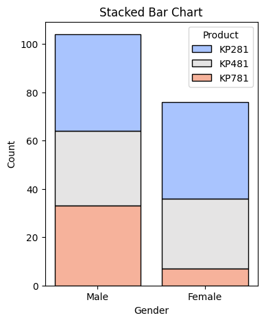
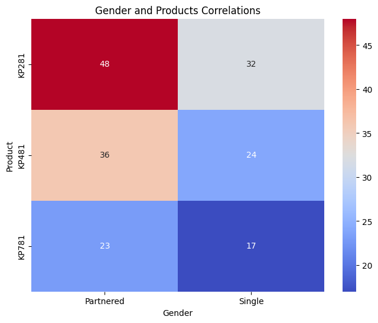
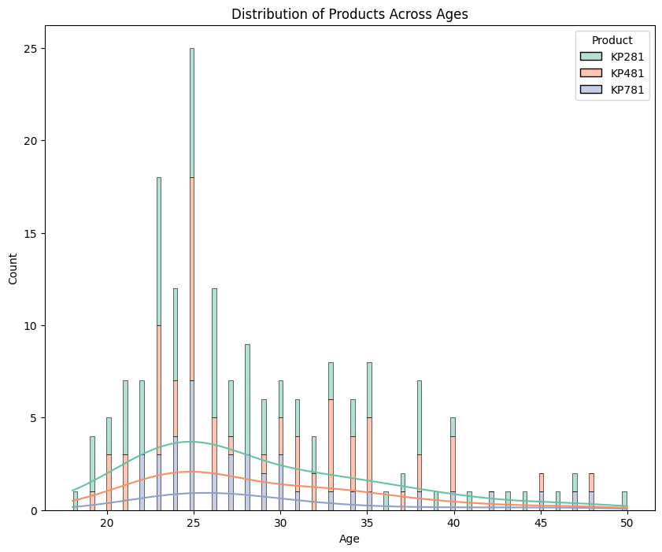
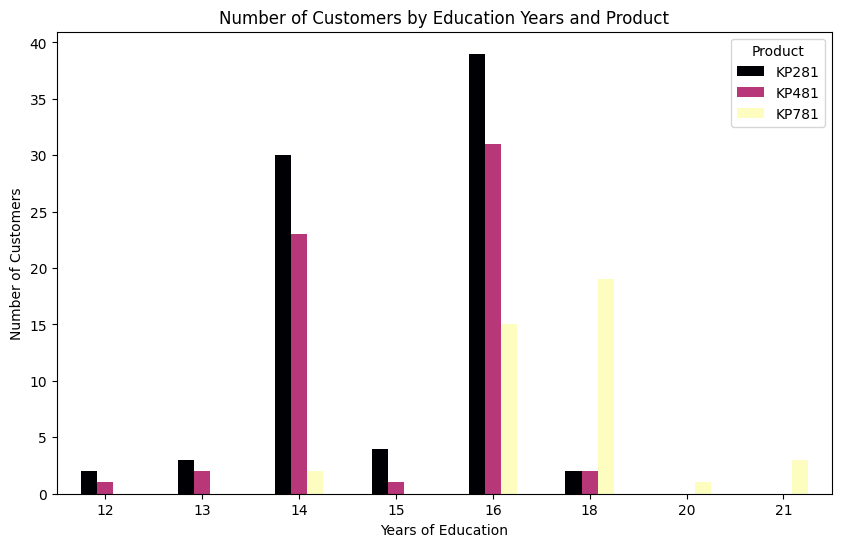
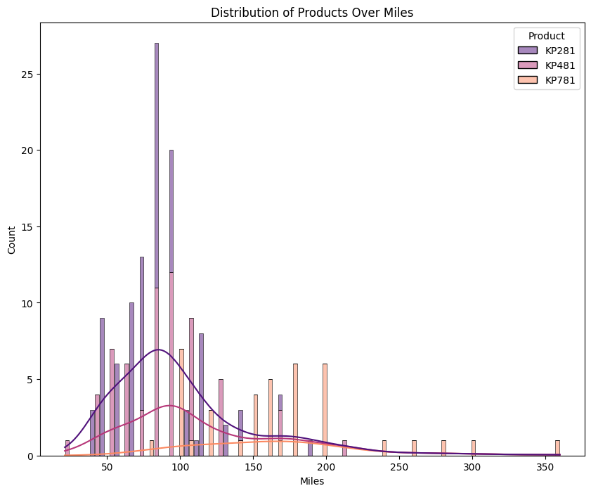
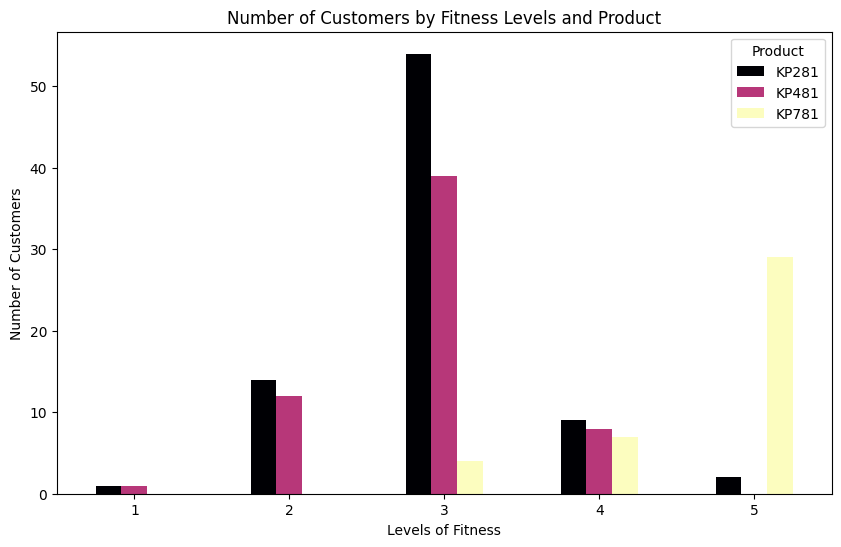
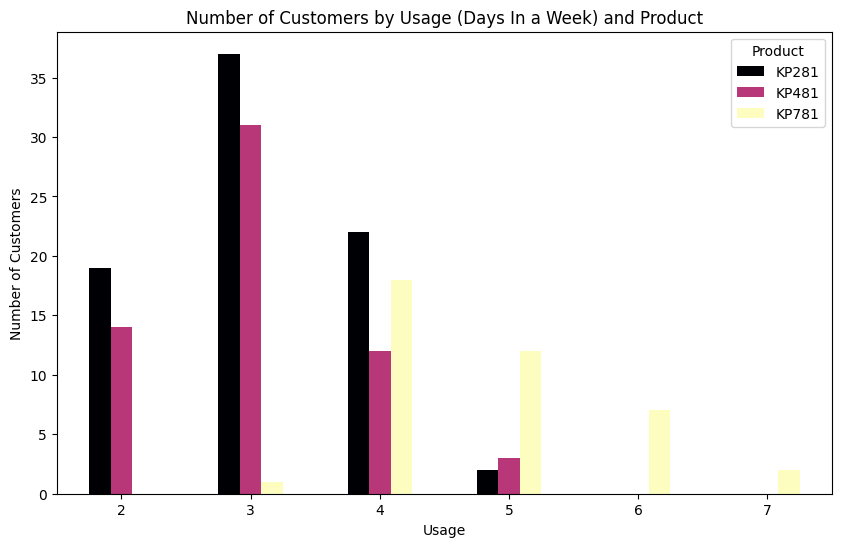

# AeroFit Market Research

## Description

The market research team at AeroFit wants to identify the characteristics of the target audience for each type of treadmill offered by the company to provide better recommendations to new customers. The team decides to investigate whether there are differences across the products concerning customer characteristics.

## Product Portfolio

- **KP281**: An entry-level treadmill that sells for $1,500.
- **KP481**: For mid-level runners and sells for $1,750.
- **KP781**: A treadmill with advanced features and sells for $2,500.

## Features Description

- **Product** - KP281, KP481, or KP781
- **Age** - In years
- **Gender** - Male/Female
- **Education** - In years
- **Marital Status** - Single or partnered
- **Usage** - The average number of times the customer plans to use the treadmill each week
- **Fitness** - Self-rated fitness on a 1-5 scale, where 1 is poor shape and 5 is excellent shape
- **Income** - Annual income in US dollars
- **Miles** - The average number of miles the customer expects to walk/run each week

## Actionable Insights  

### *Which gender should we market the products to?*

- All three models can be marketed to both males and females, except for KP781, as a very small number of females are buying that model.

### *Which marital status should we market the products to?*

- Unlike gender, there is not much difference between single and partnered customers across all products. However, overall, partnered individuals are more likely to purchase a treadmill.

### *Which age group should we market the products to?*

- People in their 20s and 30s are the best group to market to.
- This age group is buying all three models.

### *How does education (years) reflect on the products?*

- Customers with education levels between 14 and 16 years are buying KP281, whereas those with higher education levels are buying KP781.

### *Which product should we suggest to customers who will be using the treadmill excessively?*

- These graphs clearly suggest that customers with a higher fitness level, who run more miles, and those who use the treadmill daily should be buying KP781, as it has advanced features suited for this group.

## Outliers Analysis

### Categorical Data

All categorical data seemed valid:

- **Gender** = 2 unique values ✅ (Male, Female)
- **Marital Status** = 2 unique values ✅ (Single, Partnered)
- **Products** = 3 unique values ✅ (KP281, KP481, KP781)
- **Fitness** = 1-5 ✅

### Numeric Data

- For **Education**, some people had 20 and 21 years of education, which is valid if PhDs and doctorates are considered.
- Some individuals were aged between 47-50, which is reasonable for treadmill users.
- **Usage** (measured by how many times a week) had outlier values of 6 and 7, implying that some people use a treadmill daily.
- Some individuals had extremely high **Income**, which was cross-checked as they owned KP781, the most expensive treadmill model.
- People who ran the most **Miles** were mostly at fitness level 5.

None of the outliers seemed invalid; therefore, I didn’t remove any.

