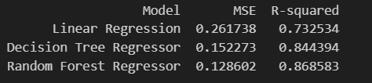
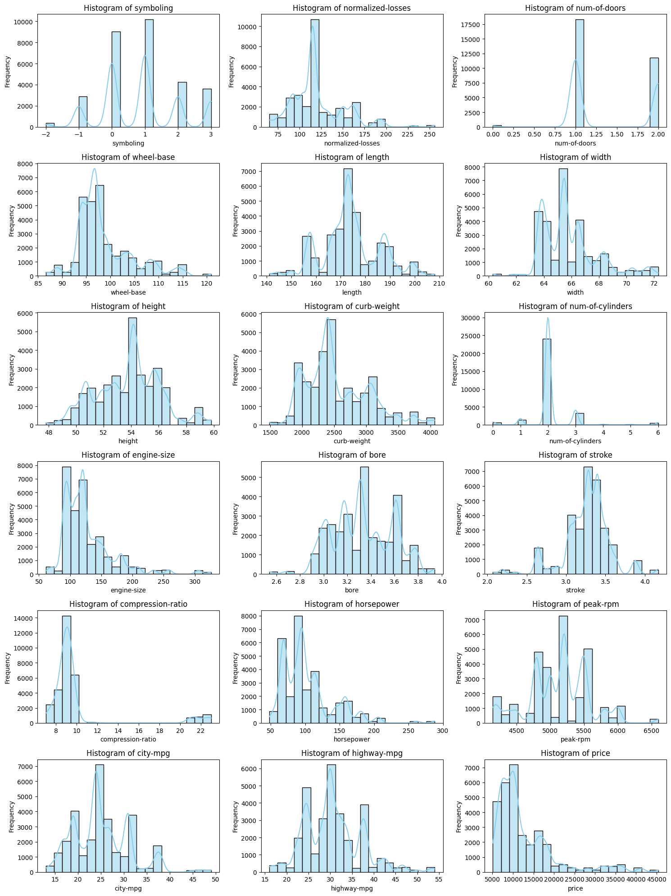
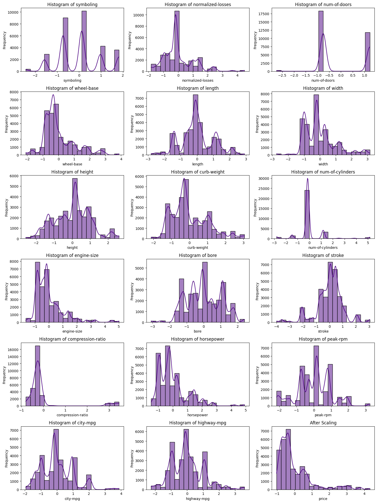

# Price Prediction For Cars

### Dataset Description:
- More than 30,000 rows
- 26+ features
- 61% of the data was categorical

## Model Perfomance

- The results clearly explain the common belief of random forest outperforming the other two as it averages multiple decisions.

- Linear Regression clearly validates the fact of being bad at recognizing multicollinearity (independent variables being highly correlated)

 

## Room For Improvement
- Manipulating hyperparameters can significantly help in case of DT and RF.
- The current data was not handled for skewness.

## Sequence Followed
### Data Inspection 
🔨 used .info(), .describe(), missingno., .skew(), valuecount()

🔨 Distributions seemed normal mostly, except width, curb-weigth, compression-ratio, city-mpg, highway-mpg, engine size.

🔨 valuecounts() revealed that some columns appear object even though they are numerical

🔨 This might have happened because some columns had ? instead of relevant values

🔨 Used to_numeric to convert such columns into numerical

### Imputation or Handling Nulls

🔨 used Simple Imputer's mode and most frequent strategy to handle both numerical and categorical.

🔨 no more nulls

### Encoding

🔨 Label Encoder for ordinal

🔨 Dummies for nominal 

### Scaling

**Before Scaling**

 

🔨 used Standard Scaler

 

**After Scaling**

 

### Selecting Features

🔨 used .corr
🔨 used a threshold of 0.3 

### ML Model

🔨Split 20:80 -> test: train

