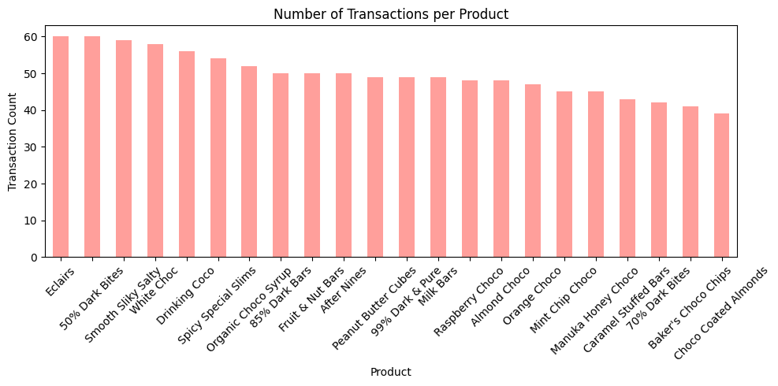
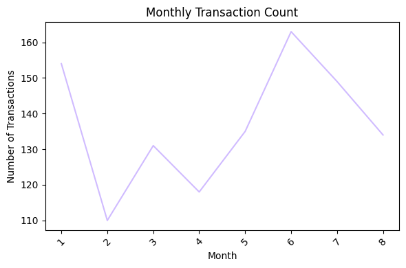
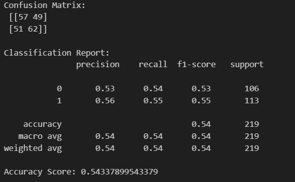
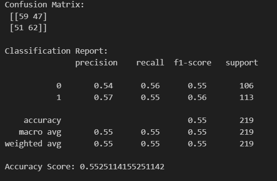
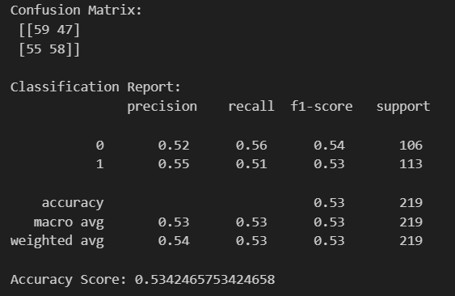
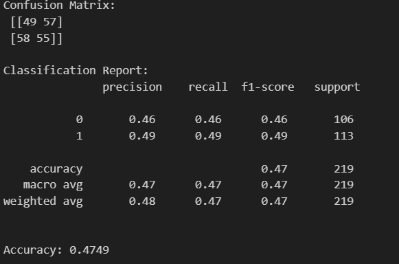
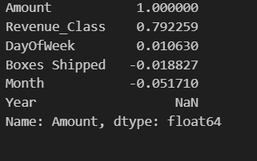
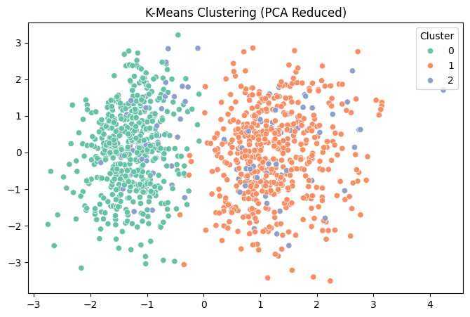

### 

#### Dataset Description

#### Country Wise Revenue Contribution

- Austrailia 🥇 1,137,367
- UK 🥈 1,051,792.0
- India 🥉1,045,800.0

#### Unique Products 

- 22

####
 

**Products and their transactions**

 

**Month-Year Contribution**

 

**Monthly Contributions**

## How to approach data for different models?

### KNN
- Standard Scaling
- Experiment with different K values

**when k=3** ⏬

 

**when k=5** ⏬

 

**when k=7** ⏬

 

 

- We can conclude that we will need fix the input for better results

### Decision Tree

same pre-process as knn

 

- Its hard to figure out an improvment as features are not impacting results properly

**Results of corr between data and amount**

### Random Forest, LogReg

- All of them are showing accuracy no more than 50%
- This indicates that data is not good for predictions

### Kmeans

 

 

## Missed Arrows

- Not scaling returns same accuracy 
- changing threshold of amouunt from median to near mean (5000) doesn't make much difference
