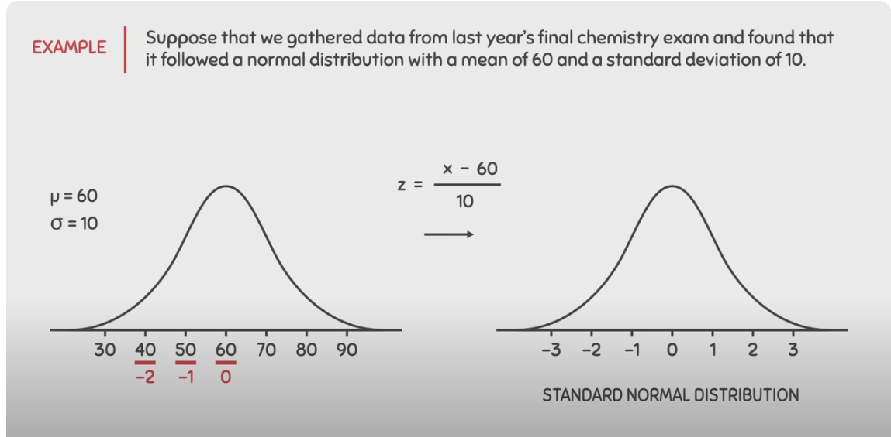

# Normal Distribution

- for normal dist data, use z score

- Any normal distribution can be converted to standard normal distribution (mean = 0, std= 1). This is done through a table that we have to find areas to the left using z-score. 

- In code, this is simply StandardScaler. 

### Below [image from YT video](https://www.youtube.com/watch?v=2tuBREK_mgE) 

# Right Skewed 

for skewed, use **IQR**
 

### IQR 

- get percentiles 
- Q1 - 25%, q2 - 50% so on
- calculate IQR 
-  IQR = Q3-Q1
- lower bound = Q1 - 1.5 * IQR
- upper bound = Q3 + 1.5 * IQR
- we keep everything above lb and below ub. remove everything else.

